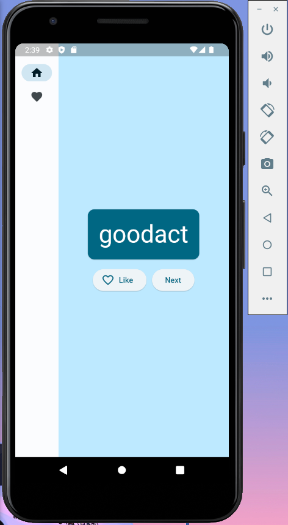

# Random Word Generator App
This Flutter application allows you to generate random English words and manage your favorite words. It's a simple yet useful app that demonstrates the usage of the "english_words" library.

## Features:
- Generate Random Words: The app generates random English words using the "english_words" library. Each time you open the app or tap a button, a new random word will be displayed on the screen.

- Favorite Words: You can mark any word as a favorite by tapping the heart icon next to it. Favorited words are saved in your app's memory, allowing you to access them even after closing the app.

- View Favorite Words: The app provides a dedicated screen where you can view all your favorited words. This screen displays the list of your favorite words in a scrollable format, making it easy to browse through them.

- Remove from Favorites: If you decide to remove a word from your favorites, simply tap the remove button associated with that word. The word will be removed from your favorites list and will no longer appear on the dedicated screen.

## Technologies Used:
- Flutter: The app is developed using the Flutter framework, which enables cross-platform app development with a single codebase. Flutter's hot-reload feature makes it easy to experiment and iterate quickly.

- english_words Library: The "english_words" library is utilized to generate random English words in the app. It provides a rich collection of English word pairs that can be easily integrated into Flutter projects.

## Getting Started:
To get started with the Random Word Generator app, follow these steps:

1. Clone the repository to your local machine.
2. Ensure you have Flutter and Dart SDK installed on your system.
3. Open the project in your preferred IDE or editor.
4. Run ```flutter pub get``` in the project directory to fetch the dependencies.
5. Connect a device or start an emulator.
6. Run ```flutter run``` to launch the app on your device/emulator.
Feel free to explore the code, customize the app, and contribute to its development. If you encounter any issues or have suggestions, please create an issue in the repository.

Give it a try and have fun generating random words and managing your favorite word collection!

